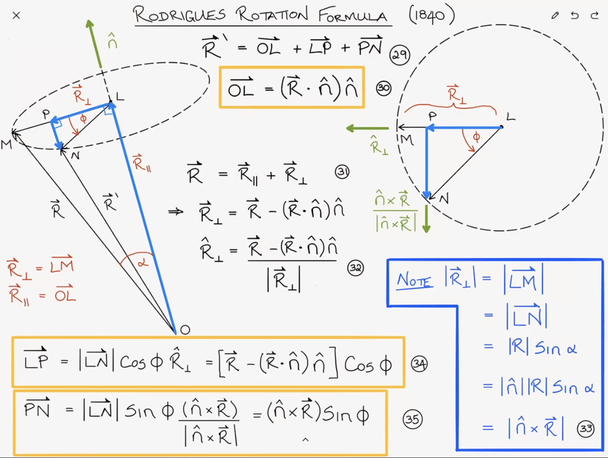
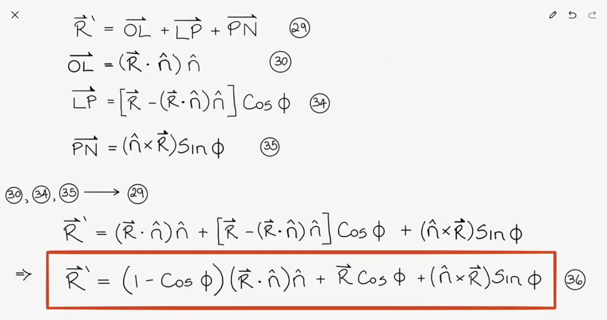

# Matrix multiplication

Left matrix multiplication of a vector performs a transformation of basis. This means the resulting vector is expressed as a linear combination of the matrix's column vectors.

This concept intuitively explains the Rotation Matrix:$$\begin{bmatrix} \cos\theta & -\sin\theta \\ \sin\theta & \cos\theta \end{bmatrix} \begin{bmatrix} x \\ y \end{bmatrix}$$
- The first column is where the unit $x$-axis lands.
- The second column is where the unit $y$-axis lands.

Unlike simple scalar multiplication (which only scales the magnitude), matrix multiplication redefines the coordinate system itself by repositioning these basis vectors in the column space.

# Rotation

Rotation represents the relationship between two points on a circle with radius $r$.

# Rotation matrix

## Rotation as a Linear Combination of Orthogonal Basis

Suppose there is an arbitrary vector $\mathbf{r} = [x, y]^T $ on a 2D plane :
    - Self (Original): $\mathbf{r} = [x, y]^T$
    - Perpendicular ($90^{\circ}$ rotated): $\mathbf{r}_{\perp} = [-y, x]^T$

The rotated vector $\mathbf{r}'$ by an angle $\theta$ can be expressed as a linear combination of these two orthogonal vectors:$$\mathbf{r}' = \cos\theta \cdot \mathbf{r} + \sin\theta \cdot \mathbf{r}_{\perp}$$

**Expansion and Verification**

If we expand the equation by substituting the components:
$$\begin{aligned}
\mathbf{r}' &= \cos\theta \begin{bmatrix} x \\ y \end{bmatrix} + \sin\theta \begin{bmatrix} -y \\ x \end{bmatrix} \\
&= \begin{bmatrix} x\cos\theta - y\sin\theta \\ y\cos\theta + x\sin\theta \end{bmatrix}
\end{aligned}$$

This matches the result of the standard Rotation Matrix multiplication:$$\begin{bmatrix} \cos\theta & -\sin\theta \\ \sin\theta & \cos\theta \end{bmatrix} \begin{bmatrix} x \\ y \end{bmatrix}$$

**Conclusion**

In essence, 2D rotation is simply a mixing process of "Self" and the "$90^{\circ}$ rotated version of Self" according to the weights of $\cos\theta$ and $\sin\theta$.

## Derivation of the Rotation Matrix

### 2D Space

1. **Identify Basis Vectors**: Start with standard bases $\mathbf{e}_1 = [1, 0]^T$ and $\mathbf{e}_2 = [0, 1]^T$.

2. **Rotate Bases**: Applying a rotation of $\theta$, the new positions become $\mathbf{e}'_1 = [\cos\theta, \sin\theta]^T$ and $\mathbf{e}'_2 = [-\sin\theta, \cos\theta]^T$.

3. **Construct Matrix**: The rotation matrix $R$ is formed by placing these rotated bases as its columns: $R = [\mathbf{e}'_1 \mid \mathbf{e}'_2]$.

### 3D space

The rotatioin matrix $R$ in 3D is expanded concept of rotation in 2D to $x,y,z$ axes. 

**Elementary Rotations**

The basic form is rotation with fixing each $x,y,z$ axis. 

- x-axis rotation $R_x$: $x$ coordinate is fixed and rotate on $y, z$ plane: $$R_x(\theta) = \begin{bmatrix} 1 & 0 & 0 \\ 0 & \cos\theta & -\sin\theta \\ 0 & \sin\theta & \cos\theta \end{bmatrix}$$

    When rotating about the X-axis, the X-coordinate remains invariant while the transformation occurs entirely within the YZ-plane.

    Initial Bases:$$\mathbf{e}_1 = \begin{bmatrix} 1 \\ 0 \\ 0 \end{bmatrix}, \mathbf{e}_2 = \begin{bmatrix} 0 \\ 1 \\ 0 \end{bmatrix}, \mathbf{e}_3 = \begin{bmatrix} 0 \\ 0 \\ 1 \end{bmatrix}$$

    **Step 1**: The X-basis ($\mathbf{e}_1 \to \mathbf{e}_1'$)Since the X-axis is the axis of rotation, the vector $\mathbf{e}_1$ does not move.$$\mathbf{e}_1' = \begin{bmatrix} 1 \\ 0 \\ 0 \end{bmatrix}$$

    **Step 2**: The Y-basis ($\mathbf{e}_2 \to \mathbf{e}_2'$)The vector $\mathbf{e}_2$ starts on the Y-axis ($y=1, z=0$). As it rotates toward the Z-axis:$y$-component: Decreases from 1 following $\cos\theta$.$z$-component: Increases from 0 following $\sin\theta$.$$\mathbf{e}_2' = \begin{bmatrix} 0 \\ \cos\theta \\ \sin\theta \end{bmatrix}$$Note: At $\theta = 0$, $\mathbf{e}_2'$ correctly returns to $[0, 1, 0]^T$.

    **Step 3**: The Z-basis ($\mathbf{e}_3 \to \mathbf{e}_3'$)The vector $\mathbf{e}_3$ starts on the Z-axis ($y=0, z=1$). As it rotates, it moves toward the negative Y-direction:$y$-component: Moves into the negative region, following $-\sin\theta$.$z$-component: Decreases following $\cos\theta$.$$\mathbf{e}_3' = \begin{bmatrix} 0 \\ -\sin\theta \\ \cos\theta \end{bmatrix}$$

    **Constructing the Matrix ($R_x$)**: The rotation matrix is formed by concatenating these transformed bases as its columns:$$R_x(\theta) = \begin{bmatrix} \mathbf{e}_1' & \mathbf{e}_2' & \mathbf{e}_3' \end{bmatrix} = \begin{bmatrix} 1 & 0 & 0 \\ 0 & \cos\theta & -\sin\theta \\ 0 & \sin\theta & \cos\theta \end{bmatrix}$$

- y-axis rotation $R_y$: $y$ coordinate is fixed and rotate on $x, z$ plane: $$R_y(\theta) = \begin{bmatrix} \cos\theta & 0 & \sin\theta \\ 0 & 1 & 0 \\ -\sin\theta & 0 & \cos\theta \end{bmatrix}$$

    **Step 1**: The Y-basis ($\mathbf{e}_2 \to \mathbf{e}_2'$)The Y-axis is the axis of rotation, so $\mathbf{e}_2$ remains unchanged.$$\mathbf{e}_2' = \begin{bmatrix} 0 \\ 1 \\ 0 \end{bmatrix}$$

    **Step 2**: The Z-basis ($\mathbf{e}_3 \to \mathbf{e}_3'$)The vector $\mathbf{e}_3$ starts on the Z-axis ($z=1, x=0$). As it rotates toward the X-axis:$z$-component: Decreases following $\cos\theta$.$x$-component: Increases following $\sin\theta$.$$\mathbf{e}_3' = \begin{bmatrix} \sin\theta \\ 0 \\ \cos\theta \end{bmatrix}$$

    **Step 3**: The X-basis ($\mathbf{e}_1 \to \mathbf{e}_1'$)The vector $\mathbf{e}_1$ starts on the X-axis ($x=1, z=0$). As it rotates, it moves toward the negative Z-direction:$x$-component: Decreases following $\cos\theta$.$z$-component: Moves into the negative region, following $-\sin\theta$.$$\mathbf{e}_1' = \begin{bmatrix} \cos\theta \\ 0 \\ -\sin\theta \end{bmatrix}$$

    **Constructing the Matrix ($R_y$)**: By placing these transformed bases as columns ($[\mathbf{e}_1' \mid \mathbf{e}_2' \mid \mathbf{e}_3']$), we get:$$R_y(\theta) = \begin{bmatrix} \cos\theta & 0 & \sin\theta \\ 0 & 1 & 0 \\ -\sin\theta & 0 & \cos\theta \end{bmatrix}$$

- z-axis rotation $R_z$: $z$ coordinate is fixed and rotate on $x, y$ plane: $$R_z(\theta) = \begin{bmatrix} \cos\theta & -\sin\theta & 0 \\ \sin\theta & \cos\theta & 0 \\ 0 & 0 & 1 \end{bmatrix}$$

    **Step 1**: The Z-basis ($\mathbf{e}_3 \to \mathbf{e}_3'$)Since the Z-axis is the axis of rotation, the vector $\mathbf{e}_3$ is unchanged.$$\mathbf{e}_3' = \begin{bmatrix} 0 \\ 0 \\ 1 \end{bmatrix}$$

    **Step 2**: The X-basis ($\mathbf{e}_1 \to \mathbf{e}_1'$)The vector $\mathbf{e}_1$ starts on the X-axis ($x=1, y=0$). As it rotates toward the Y-axis:$x$-component: Decreases following $\cos\theta$.$y$-component: Increases following $\sin\theta$.$$\mathbf{e}_1' = \begin{bmatrix} \cos\theta \\ \sin\theta \\ 0 \end{bmatrix}$$

    **Step 3**: The Y-basis ($\mathbf{e}_2 \to \mathbf{e}_2'$)The vector $\mathbf{e}_2$ starts on the Y-axis ($x=0, y=1$). As it rotates, it moves toward the negative X-direction:$x$-component: Moves into the negative region, following $-\sin\theta$.$y$-component: Decreases following $\cos\theta$.$$\mathbf{e}_2' = \begin{bmatrix} -\sin\theta \\ \cos\theta \\ 0 \end{bmatrix}$$

    **Constructing the Matrix ($R_z$)**: By placing these transformed bases as columns ($[\mathbf{e}_1' \mid \mathbf{e}_2' \mid \mathbf{e}_3']$), we obtain:$$R_z(\theta) = \begin{bmatrix} \cos\theta & -\sin\theta & 0 \\ \sin\theta & \cos\theta & 0 \\ 0 & 0 & 1 \end{bmatrix}$$

# Rotation axis

## Relation between Rotation Matrix and Rotation Axis

There is a strong linear algebraic relationship between Rotation matrix($R$) and rotation axis($\mathbf{\hat{v}}$).

**From view point of eigen vector**

A 3D rotation matrix $R$ rotates vectors in space. However, a vector that lies on the axis of rotation remains unchanged after the rotation.

This invariant property can be expressed with the following formula:$$R\mathbf{\hat{\mathbf{v}}} = 1\mathbf{\hat{\mathbf{v}}}$$

$$ R\mathbf{\hat{v}} = 1\mathbf{\hat{v}} $$

- This is a typical eigenvalue problem ($A\mathbf{x} = \lambda \mathbf{x}$).
- The eigenvector of the rotation matrix $R$ corresponding to the eigenvalue $\lambda = 1$ is the rotational axis of the matrix $R$.

## 2D rotation

In 2D rotation, the rotation axis $\mathbf{\hat{v}}$ is perpendicular to the $xy$-plane, represented as:$$\mathbf{\hat{v}} = \odot \text{ (out of page)}$$

# Rodrigues Rotation Formula

**Summary**

Consider a vector $\mathbf{v}$. The rotated vector $\mathbf{v}_{rot}$, obtained by rotating $\mathbf{v}$ about the axis $\mathbf{u}$ by an angle $\theta$, is defined as:

$$ \mathbf{v}_{rot} = \mathbf{v}\cos{\theta} + (\mathbf{u} \times \mathbf{v})\sin{\theta} + \mathbf{u}(\mathbf{u} \cdot \mathbf{v})(1 - \cos{\theta})$$

- Reference
    - https://www.youtube.com/watch?v=CQSC5W5bPXQ

# Connecting Euler, Rodrigues, and Quaternion

